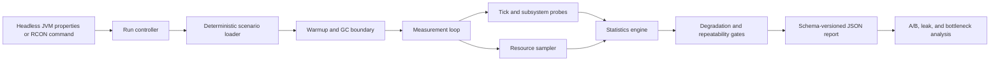

# SwagBench

[](https://github.com/KyleHafner/swagbench-forge/actions/workflows/ci.yml)

A deterministic Minecraft Forge 1.18.2 dedicated-server benchmark harness for measuring tick performance without hiding noisy runs.

SwagBench creates a controlled benchmark dimension, executes repeatable server workloads, records tick and subsystem timing, tracks GC contamination and host pressure, and emits a stable JSON report for automation.

> This is the public source edition. Machine-specific acceptance logs, host inventories, generated worlds, and binary artifacts remain private. The source, tests, report contract, and verification scripts are included.

## Engineering focus

- **Controlled workloads:** fixed scenario coordinates, structure placement, gamerules, seed, and force-loaded chunks
- **Clean and raw timing:** contaminated ticks remain available for diagnosis while clean statistics support comparisons
- **Robust statistics:** median, percentiles, standard deviation, and median absolute deviation (MAD)
- **Noise refusal:** reports are degraded when GC contamination, active swap, or timing dispersion makes marginal comparisons unreliable
- **Subsystem attribution:** entities, block entities, chunks, scheduled ticks, networking, and residual work
- **Resource context:** CPU, disk, memory, cgroup, and optional allocation measurements
- **Stable automation contract:** schema-versioned JSON plus explicit process exit codes
- **Analysis tools:** repeatability summaries, A/B comparison, leak detection, and bottleneck attribution

## Architecture



Detailed design notes:

- [Measurement methodology](docs/methodology.md)
- [Report and exit-code contract](docs/report-contract.md)
- [Privacy and operational safety](docs/privacy.md)

## Build and test

Requirements:

- Java 17
- Bash and Python 3 for the verification scripts
- Network access on the first build for Gradle, Forge, and Minecraft dependencies

```bash
./gradlew test build --no-daemon
```

The test suite contains 115 JUnit tests covering statistics, report writing, controller transitions, resource probes, network framing, Forge metadata, mixin shape, scenario loading, and the analysis tools.

## Headless benchmark

The benchmark server is driven through JVM properties:

```bash
./gradlew runServer --no-daemon \
  -Dswagbench.run=scenario=mixed-v1,seed=0,warmup=2000,measure=2000,runs=3 \
  -Dswagbench.output="$PWD/build/swagbench-reports"
```

Each run writes one `schemaVersion: 1` report. The default output directory is `swagbench-reports/`.

Stable exit codes:

| Code | Meaning |
|---:|---|
| `0` | Completed and report is not degraded |
| `2` | Setup or report-write failure |
| `3` | Report written, but environmental or statistical gates marked it degraded |

Headless execution calls `System.exit(code)` so an external driver can trust process status. `-Dswagbench.noExit=true` is reserved for development probes.

## Verification scripts

Quick contract smoke test:

```bash
scripts/headless-smoke.sh
```

Three-run repeatability gate:

```bash
SWAGBENCH_REPEAT_SCENARIO=calibration-v1 \
  scripts/headless-repeatability.sh
```

Both scripts bind the temporary offline-mode benchmark server to loopback. The repeatability script refuses acceptance runs when its cgroup is already swapping or one-minute load exceeds visible CPU capacity. `SWAGBENCH_REPEAT_SKIP_PREFLIGHT=1` is diagnostic-only and should not be used as acceptance evidence.

## In-game and RCON commands

Commands require permission level 2:

```text
/swagbench run
/swagbench run <scenario> <seed> <warmup> <measure>
/swagbench status
/swagbench abort
/swagbench config
```

The headless path owns an uncapped tick loop and is the intended acceptance path. Command-driven runs remain event-paced and are useful for development and diagnostics, not marginal performance claims.

## RNG Pinning Limits

`RngHarness` reports `fullyPinned=false` until every reachable source of nondeterminism can be audited.

Pinned:

- benchmark seed and target-dimension random source;
- daylight, weather, mob spawning, mob griefing, and random-tick gamerules;
- scenario coordinates, force-loaded chunks, structure placement, and entity census.

Not fully pinned:

- vanilla or mod internals that create fresh random state after setup;
- entity AI, collision, iteration order, and scheduler timing;
- block-entity and redstone phase behavior;
- pack-specific sources reachable only after expanding the workload.

Future drivers should treat `fullyPinned=false`, high MAD, or `degraded=true` as refusal signals for marginal comparisons, not as noise to average away.

## Current limitations

SwagBench deliberately reports several unresolved boundaries rather than presenting false precision:

- `fullyPinned=false` remains expected while reachable vanilla/mod random sources are not exhaustively controlled.
- `mixed-v1` includes entity AI, collision, hopper/furnace state, and redstone behavior that can retain scheduler-phase variance.
- Allocation profiling is optional because instrumentation itself perturbs the system.
- A benchmark marked `degraded=true` should not be used for sub-percent claims.
- Cross-machine comparisons require matching Java, Forge, JVM flags, heap, CPU allocation, mod set, and workload configuration.

## License

SwagBench source is released under the [MIT License](LICENSE). Forge, Minecraft, mappings, and build-tool dependencies retain their respective licenses and terms; see [Third-party notices](THIRD_PARTY_NOTICES.md).
